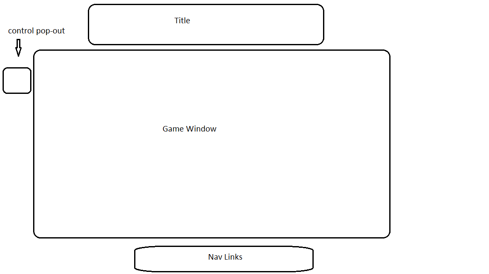
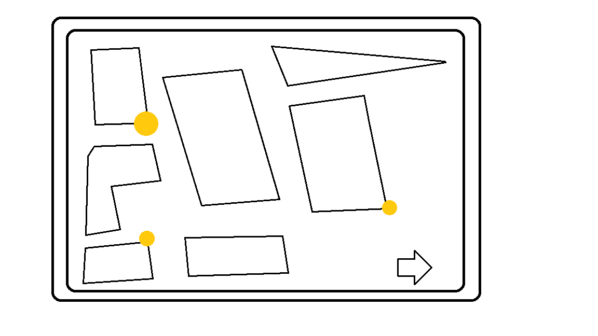
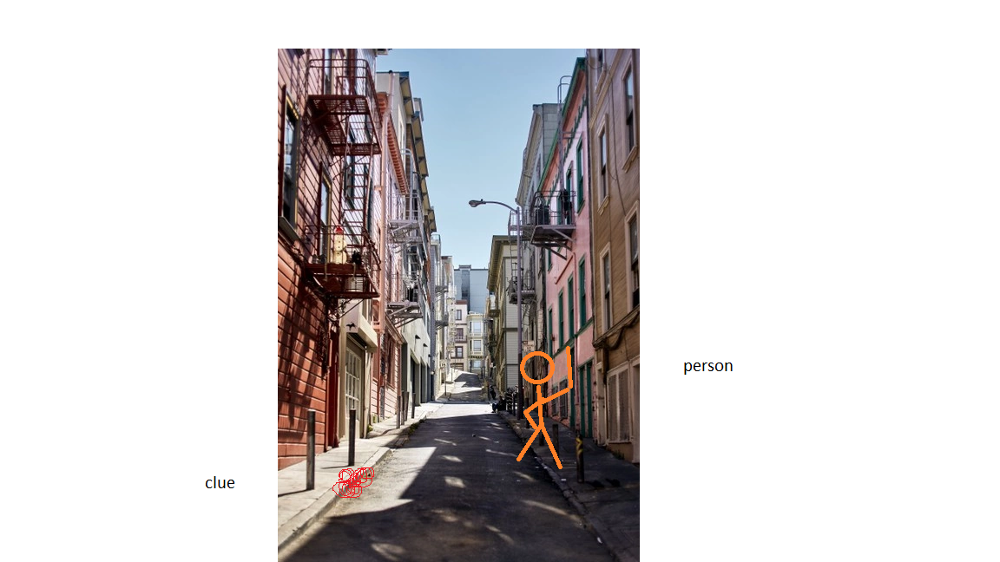
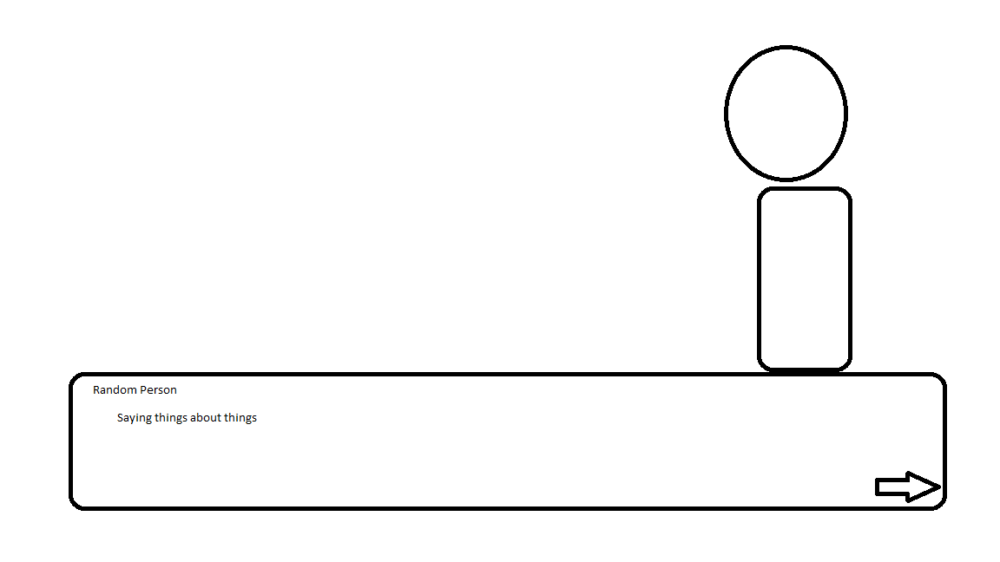
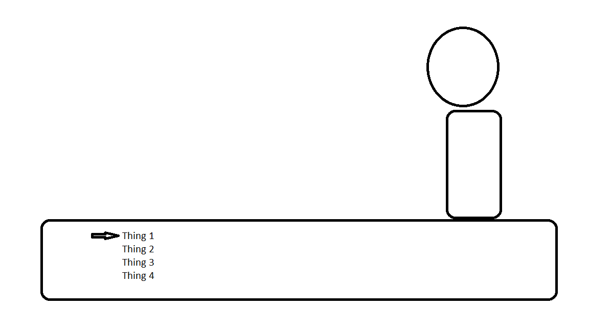

<h1>Background</h1>

'Down and Dandy' is a JavaScript mystery game where you play as Archibald, the owner of a struggling haberdashery in the downtown metro area.
You are sure that your rival business across the street is sabatoging you and you have to do some good old gumshoeing before you confront them.  

<h2>Phase I: Discovery </h2>

During the 'Discovery' phase Archibald follows rumors, collects evidence, and talks to locals to get the scoop on the underhand dealings of his rivals.
This is achieved through a point/click mechanic for investigating clues shown on your screen and following dialogue trees.  

<h2>Phase II: Confrontation</h2>

During the Confrontation phase Archibald confronts his rivals across the street. This may be done at any time, however depending on the information and 
evidence you uncover differnt moves/options will be available to you.
This section is more of a JRPG turn based strategy sectiona and will end... with DRAMA!
   
<h1>Functionality</h1>

<h3>In 'Down and Dandy', users will be able to: </h3>

<ul>
<li>open and interact with a map to change their location</li>
<li>review found clues and information in their inventory</li>
<li>interact in dialog trees with npcs.</li>
<li>Do a battle of wits and words to throw their rival in jail</li>
<li>select moves based off of found items/information</li>
</ul>

<h3>In addition, this project will include:</h3>
<ul>
<li>Intructions</li>
<li>Exciting point and click action</li>
<li>Music and sound effects</li>
<li>And (possibly) much MUCH more (or less)</li>
</ul>
  
<h1>Wireframes</h1>

<h2>Window Layout</h2>

For the gaming window Nav links will be included to this project's Github repo and my LinkedIn

 
 

<h2>Map Layout</h2>

For the map I plan to have it as an overlay over the current location. I am having points of interest in represented by dots (for the moment) and clicking on them will take you to that location. The arrow will put the map away, letting you interact with the current location.

 
 

<h2>Location Layout</h2>

This is the basic location layout. The location will have two main events. Talking to a person or investigating a clue. Both will be point and click interactions.

 
 

<h2>Conversation Layout</h2>

When interacting with a person a close up of them will be in the foreground while the background is out of focus. The arrow will allow you to fast forward though the dialogue
 
 

There will be the option to have the player make responses. Arrow keys/ mouse clicks should work for that.

 

<h1>Implementation Timeline</h1>

<ul>
    <li>Friday Afternoon & Weekend: Setup project, get cavas to show on the screen, create Location, Clue, and NPC Classes. Attempt to create one location with one clue and one person</li>
    <li>Monday: Create the remaining locations/clues/npcs. Overall there should be three total locations.</li>
    <li>Tuesday: Start Confrontration scene. Implement the JPG turn based strategy via revamping dialogue tree </li>
    <li>Wednesday: Finish confrontation and add details to anything missed or that I didn't have time to finish</li>
    <li>Thursday Morning: Deploy and get hyped to present </li>
</ul>

 
 
<h1>Bonus Features</h1>
Additional directions to take this project include:
<ul><li>Additional locations</li>
    <li>Additional npcs</li>
    <li>Love interests</li>
    <li>More than one villian and a second Act!</li>
</ul>