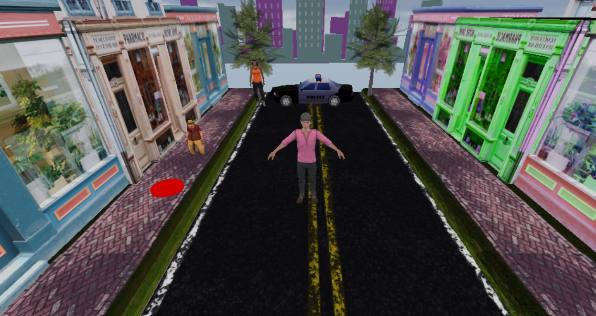
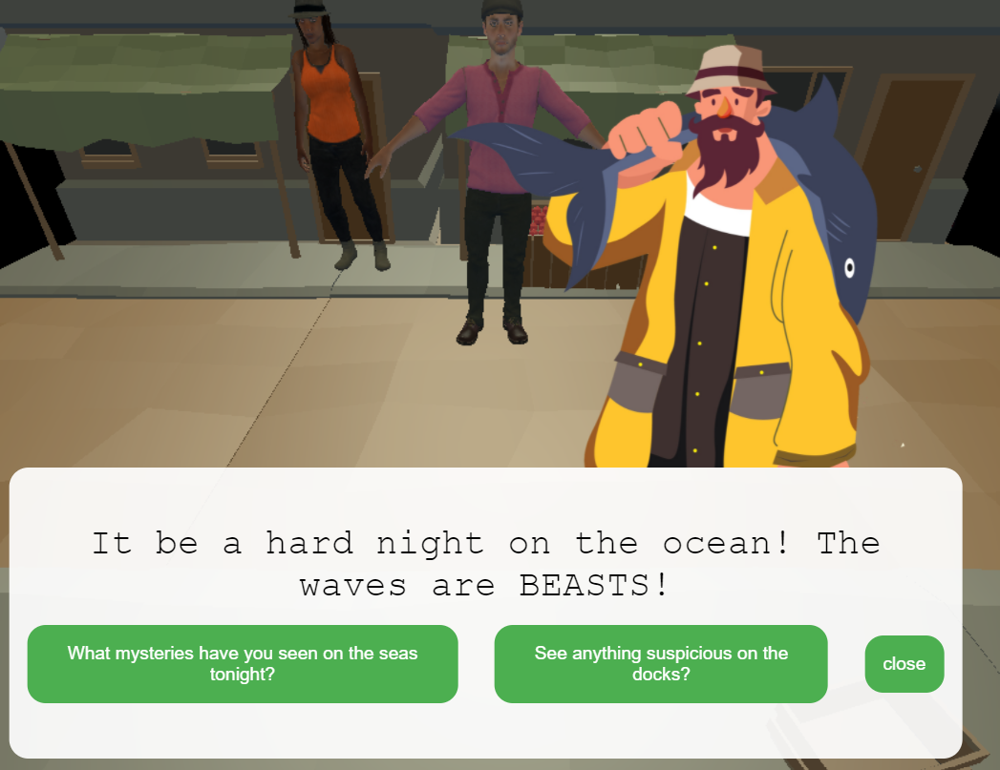
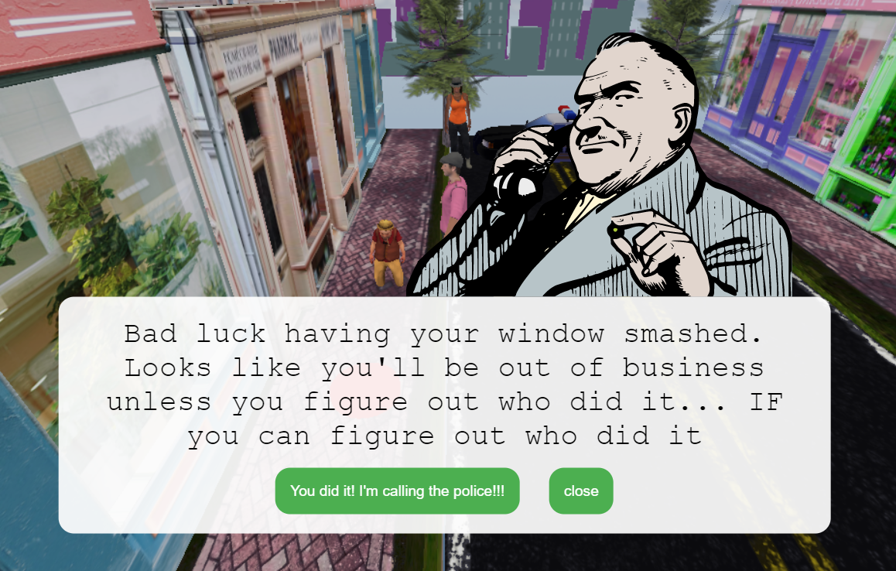

<a href='https://alvitovitch.github.io/Down-and-Dandy/' target='_blank'>Live Site</a>
<br>

<h1>Background</h1>

<br>
'Down and Dandy' is a JavaScript mystery game where you play as Archibald, the owner of a struggling haberdashery in the downtown metro area.
You are sure that your rival business across the street is sabotaging  you and you have to do some good old gumshoeing before you confront them.<br><br>

<h2>Phase I: Discovery </h2>
<p align="center" dir='auto'>

</p>
<br>
During the 'Discovery' phase Archibald follows rumors, collects evidence, and talks to locals to get the scoop on the underhand dealings of his rivals.
This is achieved through a point/click mechanic for investigating clues shown on your screen and following dialogue trees.<br><br>

<h2>Phase II: Confrontation</h2>

<br>
During the Confrontation phase Archibald confronts his rivals across the street. This may be done at any time, however depending on the information and 
evidence you uncover different things will happen!
<br><br><br>
<h1>Functionality</h1>

<h3>In 'Down and Dandy', users will be able to: </h3>

<ul>
<li>open and interact with a map to change their location</li>
<li>interact in dialog trees with npcs.</li>
<li>Do a battle of wits and words to throw their rival in jail</li>
</ul>

<h3>In addition, this project will include:</h3>
<ul>
<li>Intructions</li>
<li>Exciting point and click action</li>
</ul>

<br>

<h1>Fun Code </h1>

Something I wanted to do was include different text from Gary based on the number of clues you found. To do that I implemented an event listener to check the found clues and switch up Gary's text based on it
```
addEventListener('click', () => {
  if (selectedLocation === haberdashery) {
    if (archibald.foundClues.length < 3 && selectedLocation === hab) {
      hab.npcArr[1].messageArr = [garyTextBox]
    } else if (archibald.foundClues.length > 2 && archibald.foundClues.length < 5) {
      hab.npcArr[1].messageArr = [garyTextBoxTwo]
    } else if (archibald.foundClues.length === 5) {
      hab.npcArr[1].messageArr = [garyTextBoxThree]
    }
  }
})
```

I also reused code for npcs and the player by implementing a Character class and having the NPC and Player classes inherit from Character

```
class Character {
    constructor(characterObjectPath, name, posArr) {
        this.loader = new FBXLoader();
        this.characterObjectPath = characterObjectPath
        this.name = name
        this.characterObject = []
        this.characterMixer = undefined
        this.size = .017
        if (posArr[0] !== undefined) {
        this.position = new THREE.Vector3(posArr[0],posArr[1],posArr[2])
        } else {
            this.position = posArr
        }
        this.actions = []
    }
}

class Player extends Character{
    constructor(characterObjectPath, name, posArr) {
        super(characterObjectPath, name, posArr)
        this.foundClues = [];
        this.unlockedLocations = [];
    }
}

class NPC extends Character {
    constructor(characterObjectPath, name, posArr, destinationArr, messageArr) {
        super(characterObjectPath, name, posArr)
        this.messageArr = messageArr
        this.destinationArr = destinationArr
    }
}
```


<br><br>
<h1>Technologies, Libraries, APIs</h1>
'Down and Dandy' will be implemented with the following technologies:
<ul>
    <li> 3js to render the scenes</li>
    <li>Webpack and Babel to bundle/transpile the JavaScript source code</li>
    <li>npm to manage the dependencies</li>
</ul>
<br><br>
<h1>Implementation Timeline</h1>

<ul>
    <h2>Friday Afternoon & Weekend:</h2> 
    <ul><li> Setup project, get canvas to show on the screen</li>
        <li> Create Location, Clue, and NPC Classes.</li>
        <li> Create Player model </li>
        <li> Have responsive movement for PLayer</li>
        <ul>
            <li>Moving through the location via mouse clicks</li>
            <li>Have the camera follow the player regardless of location</li>
            <li>Allow for interacting with the npcs/clues/evidence via proximity and clicking on the item</li>
        </ul>
        <li> Create one 3js Location for the player to explore </li>
        <li>Add one interactable person</li>
        <ul>
            <li>Click on them to start talking</li>
            <li>Have a basic dialogue tree</li>
        </ul>
        <li>Add one clue</li>
        <ul>
            <li>Be able to click on the clue and have the player walk up to it</li>    
            <li>When within proximity of the clue and it is clicked on the clue dialogue is brought up</li>    
        </ul>
        <li>Add the map UI</li>
            <ul>
                <li>Players should be able to click on the map icon and pull up the map</li>
                <li>Map should have locations marked</li>
                <li>When a location is clicked on the map UI should be put away and the location is changed</li>
            </ul>
    </ul></li>
    <br>
    <h2>Monday</h2>
    <ul><li> Create the remaining locations/clues/npcs. Overall there should be three total locations.</li>
            <li>Locations/npcs/clues</li>
                <ul>
                    <li>The Haberdashery</li>
                        <ul>
                            <li>NPC - Shop Assistant</li>
                            <li>Clue - Reciept from the docks</li>
                        </ul>
                </ul>
        </ul>
        <br>

<h2>Tuesday</h2>
<ul><li>Refine first location and work on second one
    <ul>
        <li>The Docks</li>
            <ul>
                <li>NPC - Dock Worker</li>
                <li>Clue - Illegally imported goods</li>
                <li>Clue - Shipping ledger</li>
            </ul>
    </ul>
</ul>
<br>

<h2>Wednesday</h2>
<ul>
    <li> Add third location and finish end conditions</li>
    <li>Crime Alley/ Train Station</li>
        <ul>
            <li>(optional) NPC - Lady of the Street</li>
            <li>Clue - Photos of the villain doing illegal activities</li>
            <li>Clue - Proof of counterfit goods</li>
        </ul>
</ul>
<br>
<h2>Thursday Morning</h2>
<ul>
    <li>Deploy and get hyped to present </li>
</ul>

<br>
<br>
<h1>Bonus Features</h1>
Additional directions to take this project include:
<ul><li>Additional locations</li>
    <li>Additional npcs</li>
    <li>Love interests</li>
    <li>Turn Phase II into a JRPG style convo fight!</li>
    <li>More than one villian and a second Act!</li>
    <li>Music and sound effects</li>
    <li>review found clues and information via a journal</li>


</ul>
