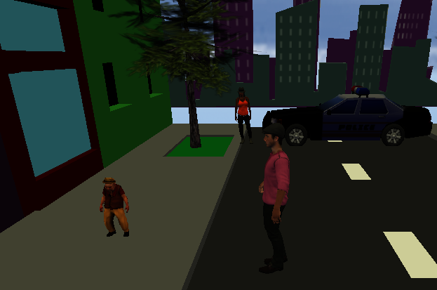
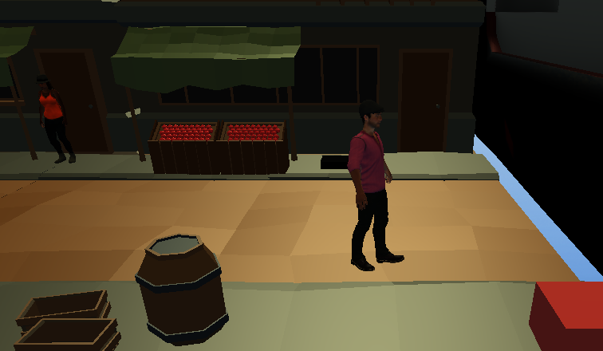
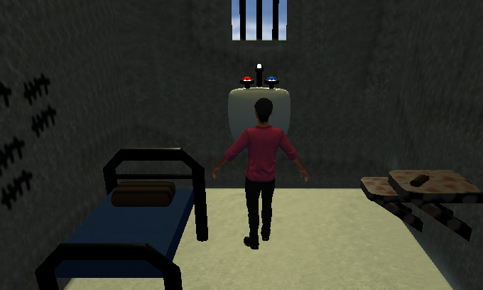

<h1> Take a look!</h1>

 
<a href='https://alvitovitch.github.io/Down-and-Dandy/' target='_blank'>Play?</a>

 

<h1>Background</h1>

'Down and Dandy' is a JavaScript mystery game where you play as Archibald, the owner of a struggling haberdashery in the downtown metro area.
You are sure that your rival business across the street is sabatoging you and you have to do some good old gumshoeing before you confront them.  

<h2>Phase I: Discovery </h2>

During the 'Discovery' phase Archibald follows rumors, collects evidence, and talks to locals to get the scoop on the underhand dealings of his rivals.
This is achieved through a point/click mechanic for investigating clues shown on your screen and following dialogue trees.  

<h2>Phase II: Confrontation</h2>

During the Confrontation phase Archibald confronts his rivals across the street. This may be done at any time, however depending on the information and 
evidence you uncover different things will happen!
   
<h1>Functionality</h1>

<h3>In 'Down and Dandy', users will be able to: </h3>

<ul>
<li>open and interact with a map to change their location</li>
<li>interact in dialog trees with npcs.</li>
<li>Do a battle of wits and words to throw their rival in jail</li>
</ul>

<h3>In addition, this project will include:</h3>
<ul>
<li>Intructions</li>
<li>Exciting point and click action</li>
</ul>
  
<h1>Wireframes</h1>

<h2>Window Layout</h2>

For the gaming window Nav links will be included to this project's Github repo and my LinkedIn

 
 

<h2>Map Layout</h2>

For the map I plan to have it as an overlay over the current location. I am having points of interest in represented by dots (for the moment) and clicking on them will take you to that location. The arrow will put the map away, letting you interact with the current location.

 
 

<h2>Location Layout</h2>

This is the basic location layout. The location will have two main events. Talking to a person or investigating a clue. Both will be point and click interactions.

 
 

<h2>Conversation Layout</h2>

When interacting with a person a close up of them will be in the foreground while the background is out of focus. The arrow will allow you to fast forward though the dialogue
 
 

There will be the option to have the player make responses. Arrow keys/ mouse clicks should work for that.

 
 
<h1>Technologies, Libraries, APIs</h1>
'Down and Dandy' will be implemented with the following technologies:
<ul>
    <li> 3js to render the scenes</li>
    <li>Webpack and Babel to bundle/transpile the JavaScript source code</li>
    <li>npm to manage the dependencies</li>
</ul>
  
<h1>Implementation Timeline</h1>

<ul>
    <h2>Friday Afternoon & Weekend:</h2> 
    <ul><li> Setup project, get canvas to show on the screen</li>
        <li> Create Location, Clue, and NPC Classes.</li>
        <li> Create Player model </li>
        <li> Have responsive movement for PLayer</li>
        <ul>
            <li>Moving through the location via mouse clicks</li>
            <li>Have the camera follow the player regardless of location</li>
            <li>Allow for interacting with the npcs/clues/evidence via proximity and clicking on the item</li>
        </ul>
        <li> Create one 3js Location for the player to explore </li>
        <li>Add one interactable person</li>
        <ul>
            <li>Click on them to start talking</li>
            <li>Have a basic dialogue tree</li>
        </ul>
        <li>Add one clue</li>
        <ul>
            <li>Be able to click on the clue and have the player walk up to it</li>    
            <li>When within proximity of the clue and it is clicked on the clue dialogue is brought up</li>    
        </ul>
        <li>Add the map UI</li>
            <ul>
                <li>Players should be able to click on the map icon and pull up the map</li>
                <li>Map should have locations marked</li>
                <li>When a location is clicked on the map UI should be put away and the location is changed</li>
            </ul>
    </ul></li>
     
    <h2>Monday</h2>
    <ul><li> Create the remaining locations/clues/npcs. Overall there should be three total locations.</li>
            <li>Locations/npcs/clues</li>
                <ul>
                    <li>The Haberdashery</li>
                        <ul>
                            <li>NPC - Shop Assistant</li>
                            <li>Clue - Reciept from the docks</li>
                        </ul>
                </ul>
        </ul>
         

<h2>Tuesday</h2>
<ul><li>Refine first location and work on second one
    <ul>
        <li>The Docks</li>
            <ul>
                <li>NPC - Dock Worker</li>
                <li>Clue - Illegally imported goods</li>
                <li>Clue - Shipping ledger</li>
            </ul>
    </ul>
</ul>
 

<h2>Wednesday</h2>
<ul>
    <li> Add third location and finish end conditions</li>
    <li>Crime Alley/ Train Station</li>
        <ul>
            <li>(optional) NPC - Lady of the Street</li>
            <li>Clue - Photos of the villain doing illegal activities</li>
            <li>Clue - Proof of counterfit goods</li>
        </ul>
</ul>
 
<h2>Thursday Morning</h2>
<ul>
    <li>Deploy and get hyped to present </li>
</ul>

 
 
<h1>Bonus Features</h1>
Additional directions to take this project include:
<ul><li>Additional locations</li>
    <li>Additional npcs</li>
    <li>Love interests</li>
    <li>Turn Phase II into a JRPG style convo fight!</li>
    <li>More than one villian and a second Act!</li>
    <li>Music and sound effects</li>
    <li>review found clues and information via a journal</li>

</ul>
